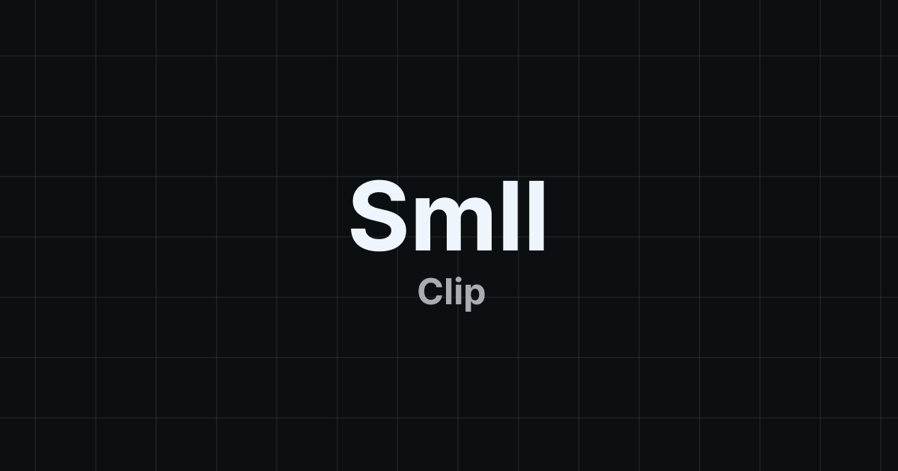

# SmllClip



## How to run the project?

1. Install all the dependencies with the command:

```bash
pnpm i
```

2. Rename the file `.template.env` to `.env` and fill the fields.

   - `FRONTEND_URL` - The URL of the frontend. For example, if you are running the project locally, it should be `http://localhost:3000`.
   - `APPWRITE_ENDPOINT` - The endpoint of the Appwrite server.
   - `APPWRITE_PROJECT_ID` - The project ID of the Appwrite server.
   - `APPWRITE_API_KEY` - The API key of the Appwrite server.

3. Run the project with the command:

```bash
pnpm dev
```

## Technologies used

- [Astro](https://astro.build/)
- [Monaco Editor](https://microsoft.github.io/monaco-editor/)
- [Astro capo](https://github.com/natemoo-re/astro-capo)
- [Appwrite](https://appwrite.io/)
- [Tailwind CSS](https://tailwindcss.com/)
- [TinyMCE](https://www.tiny.cloud/)
- [Canvas Confetti](https://www.npmjs.com/package/canvas-confetti)
